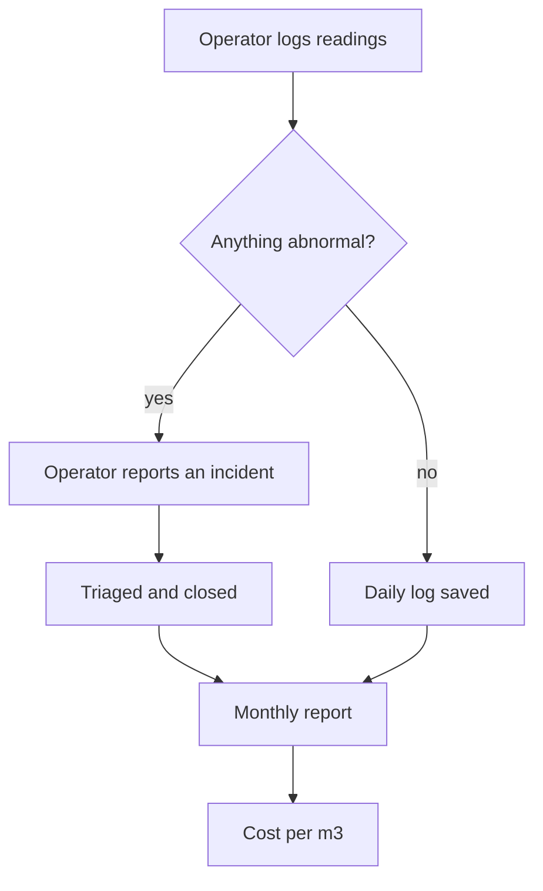

<b>Daily operations for water treatment plants, in one bilingual system</b>

نظام واحد لإدارة التشغيل اليومي لمحطات معالجة المياه، بالعربية والإنجليزية

<b>Status:</b> Pilot with water treatment companies &nbsp;·&nbsp; <b>Built by</b> <a href="https://github.com/Mohanad1st">Mohannad Hesham</a>

> This is a case study. The source is private because it runs daily operations for real companies.

## Why we built it

Many water treatment plants still run on paper logbooks and scattered spreadsheets. When readings, incidents and maintenance live in different places, maintenance gets missed, incidents go unnoticed and costs are hard to see. Dr. Water OS gives each operating company its own workspace for the daily work, in Arabic or English.

## What it does

- Operators submit daily logs, in a quick mode or a full structured mode.
- Incidents are reported, triaged and tracked to closure, with a knowledge base of standard operating procedures alongside.
- Monthly reports track completeness and export to a spreadsheet.
- An asset register keeps maintenance and calibration history (higher plans).
- Operating costs by category, with cost per cubic metre worked out for you (higher plans).
- It works offline at the plant and syncs when the connection comes back.

## How it works

## What it's built on

React · Tailwind CSS · Python (FastAPI) · a document database · managed cloud hosting

## Safeguards

- Each company's data is kept separate from every other company's.
- Roles for operators, supervisors, admins and experts.
- Company admins can review an audit trail of actions.
- AI guidance is off by default and not part of the pilot. When it is on, it suggests and people decide.
- Arabic and right-to-left layout were a requirement from day one.

## What's not solved yet

- Some features are held back from the pilot, including AI guidance and live WhatsApp notifications, which need production accounts and validation first.

## What it doesn't do

- It is not a control system. It never touches plant equipment. It records what people observe.

## More from Mohandes AI

- [Mohandes AI](https://github.com/Mohanad1st/mohandes-ai-showcase) — Applied AI for technical teams in MENA, starting with water treatment

---

© 2026 Mohannad Hesham. Showcase text and images only — no source code is published or licensed here. See all my work on <a href="https://github.com/Mohanad1st">my GitHub profile</a> · <a href="https://www.linkedin.com/in/mohannadhesham/">LinkedIn</a>.
