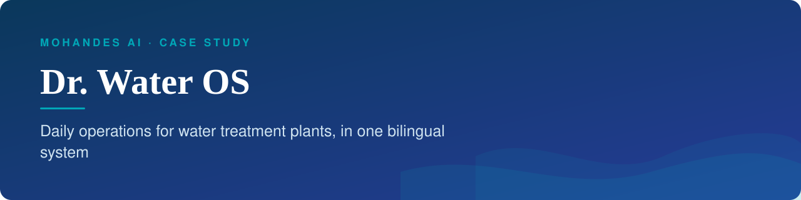
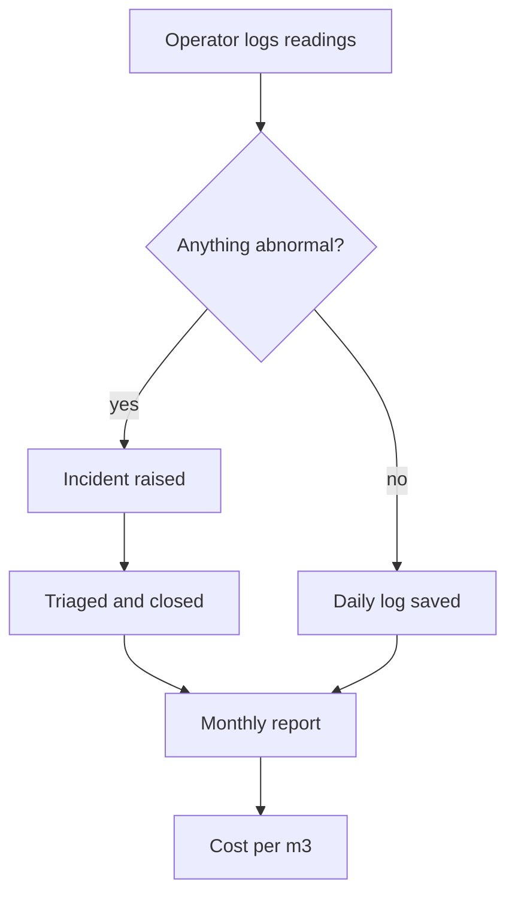

<b>Daily operations for water treatment plants, in one bilingual system</b>

نظام واحد لإدارة التشغيل اليومي لمحطات معالجة المياه، بالعربية والإنجليزية

<b>Status:</b> Paid pilot with water treatment companies &nbsp;·&nbsp; <b>Built by</b> <a href="https://github.com/Mohanad1st">Mohannad Hesham</a>

> Case study only: the source is private because it runs daily operations for real companies. Walkthrough on request.

## The problem

Water treatment plants still run on paper logbooks and scattered spreadsheets. When readings, incidents and maintenance live in different places, a supervisor finds out about a failing pump late, monthly reports take days to assemble, and nobody can see cost per cubic metre until the quarter is over. Dr. Water OS gives each operating company its own structured workspace for the daily work, in Arabic or English.

## What it does

- Operators submit daily logs in a quick mode on the floor or a full structured mode at the desk
- Incidents are reported, triaged and tracked through to closure, with standard operating procedures linked to each one
- Monthly reports with completeness tracking, exportable to spreadsheet
- An asset register with maintenance and calibration history
- Operating costs by category, with cost per cubic metre worked out automatically
- Works offline at the plant and syncs when the connection returns

## See it

How the work flows:

Screens are being re-shot with fully Arabic demo data and will be added here.

## Built with

React · Tailwind CSS · Python (FastAPI) · document database · deployed on managed cloud hosting

## Built responsibly

- Each company's data is kept separate from every other company's
- Role-based access for operators, supervisors, admins and experts
- An audit trail of actions that company admins can review
- AI features are off by default and have to be switched on deliberately
- Arabic and right-to-left layout are a first-class requirement, not a translation pass

## What it deliberately doesn't do

- It is not a control system. It never touches plant equipment; it records and organises what people observe.
- It does not let AI act on its own. Its optional assistant is off by default and only answers questions; people make the decisions.

## More from Mohandes AI

- [Mohandes AI](https://github.com/Mohanad1st/mohandes-ai-showcase) — Applied AI for technical teams in MENA — starting with water treatment

---

© 2026 Mohannad Hesham. Showcase text and images only — no source code is published or licensed here. See all my work on <a href="https://github.com/Mohanad1st">my GitHub profile</a> · <a href="https://www.linkedin.com/in/mohannadhesham/">LinkedIn</a>.
